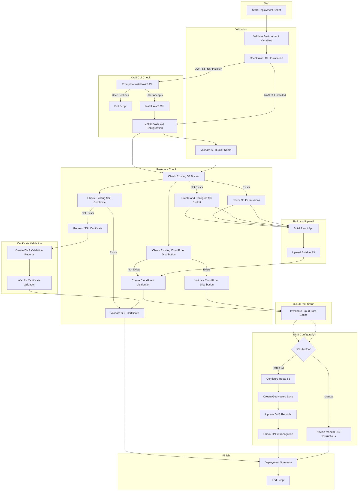
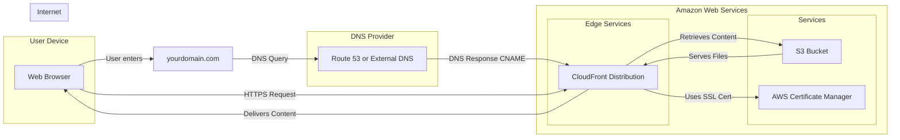

# Automated React App Deployment to AWS

This script automates the deployment process of a React application to AWS, including:

1. S3 bucket creation and configuration for static website hosting
2. CloudFront distribution setup and management
3. SSL certificate request and validation
4. DNS configuration (via Route 53 or manual instructions)

## Prerequisites

1. AWS CLI installed and configured with appropriate permissions
2. A domain name that you own
3. Node.js and npm installed (for building the React app)

## Deployment Scripts

This project includes deployment scripts in two versions:

1. PowerShell script for Windows users: `deployment/deploy.ps1`
2. Shell script for Mac and Linux users: `deployment/deploy.sh`

### Windows Users (PowerShell)

To run the script, open PowerShell and navigate to the deployment directory:

```powershell
cd path/to/your/project/deployment
.\deploy.ps1
```

### Mac and Linux Users (Shell)

To run the script, open your terminal and navigate to the deployment directory:

```bash
cd path/to/your/project/deployment
chmod +x deploy.sh  # Make the script executable (if needed)
./deploy.sh
```

Both scripts follow the same logical flow and provide similar functionality.

## Logical Script Flow



## Logical AWS Flow / Architecture



## Configuration

Create a `deploy-config.env` file in the `deployment` directory with the following content:

```
AWS_REGION=us-east-1
S3_BUCKET=your-bucket-name
AWS_CLI_PROFILE=default
DOMAIN_NAME=example.com
DNS_METHOD=route53  # Options: 'route53' or 'manual'
```

Adjust the values according to your setup.

## Deployment Steps

1. Ensure your React app is ready for deployment.

2. Run the deployment script:
   ```
   ./deployment/deploy.sh
   ```

3. The script will:
   - Validate the configuration and AWS CLI setup
   - Create or use an existing S3 bucket
   - Build your React app
   - Upload the built app to S3
   - Create or update a CloudFront distribution
   - Request and validate an SSL certificate (if needed)
   - Configure DNS (Route 53 or provide manual instructions)
   - Invalidate the CloudFront cache

## Features

### AWS CLI Installation Check
- Checks if AWS CLI is installed
- Offers to install AWS CLI if not present
- Verifies AWS CLI configuration

### S3 Bucket Management
- Creates a new S3 bucket if it doesn't exist
- Configures the bucket for static website hosting
- Sets appropriate bucket policies for public read access
- Verifies and reconfigures existing buckets if necessary

### CloudFront Distribution
- Creates a new distribution or updates an existing one
- Configures HTTPS redirection
- Associates the SSL certificate
- Invalidates CloudFront cache after deployment

### SSL Certificate Management
- Checks for an existing certificate in AWS Certificate Manager (ACM)
- Requests a new certificate if needed
- Automatically creates DNS validation records for Route 53 users
- Waits for certificate validation before proceeding
- Checks certificate expiration and initiates renewal if necessary

### DNS Configuration
- Supports automatic setup with Amazon Route 53
- Provides detailed instructions for manual DNS configuration
- Checks and reports on nameserver configuration for Route 53 users
- Verifies correct nameserver setup before proceeding with deployment

### Validation and Error Handling
- Validates S3 bucket names
- Checks AWS CLI configuration
- Provides informative error messages
- Includes a rollback mechanism in case of deployment failure

### Deployment Summary
- Provides a comprehensive summary of the deployment process
- Displays key information such as S3 bucket, CloudFront distribution, domain, and SSL certificate ARN

### Cleanup
- Removes temporary files and resources created during deployment

## DNS Configuration Methods

### Using Route 53 (DNS_METHOD=route53)
- Automatically creates a hosted zone if needed
- Provides nameserver information for new hosted zones
- Offers to automatically update Route 53 DNS records

### Manual DNS Configuration (DNS_METHOD=manual)
- Provides detailed instructions for updating DNS records
- Includes information for both root domain and www subdomain
- Gives certificate validation record details

## Notes
- DNS changes may take up to 48 hours to propagate fully.
- Certificate validation can take several minutes.
- Ensure your AWS CLI profile has necessary permissions for all operations.
- The script includes colored output and progress indicators for better user experience.

## Troubleshooting
- If the deployment fails, check the error messages provided by the script.
- Ensure all required environment variables are set correctly in `deploy-config.env`.
- Verify that your AWS CLI is configured with the correct permissions.
- For manual DNS setup, double-check that you've entered the provided records correctly at your DNS provider.
- Check the `deploy.log` file for detailed logs of the deployment process.

## Cost Estimates

Below is a rough estimate of monthly costs for running a simple React landing page on AWS using this setup. These estimates assume low to moderate traffic (up to 10,000 requests per month) and minimal data storage.

| Service | Estimated Monthly Cost | Notes |
|---------|------------------------|-------|
| S3 | < $0.10 | Minimal storage for a single-page app |
| CloudFront | < $0.50 | Based on up to 10,000 requests/month |
| Route 53 (Optional) | $0.50 | Only if using Route 53 for DNS management |
| ACM (SSL Certificate) | Free | For certificates used with CloudFront |
| Total | $0.60 - $1.10 per month | Excluding optional Route 53 |

### Additional Considerations:
- These estimates are for a low-traffic site. Costs may increase with higher traffic or data transfer.
- Route 53 is optional. You can use your own DNS provider, potentially reducing costs further.
- CloudFront's caching can help keep costs low even if traffic increases moderately.
- S3 and CloudFront have free tiers that might cover all usage for very low-traffic sites:
  - S3: First 5GB storage and 20,000 GET requests per month are free.
  - CloudFront: First 1TB of data transfer and 10,000,000 HTTP/HTTPS requests per month are free.
- ACM certificates are free when used with CloudFront.

### DNS Options:
1. **Use Route 53**: Adds $0.50/month but provides integrated DNS management within AWS.
2. **Use Your Own DNS Provider**: Potentially free, depending on your domain registrar or DNS service.

Always refer to the [AWS Pricing Calculator](https://calculator.aws/) for more accurate estimates based on your specific usage patterns. For many small, low-traffic sites, actual costs might fall within AWS's free tier offerings, potentially resulting in no charges for the first 12 months.

> **Important**: While AWS offers a free tier, certain services may incur charges depending on usage. Monitor your AWS billing dashboard regularly to avoid unexpected costs.

## Security Best Practices
- Use IAM roles with least privilege principle for AWS CLI configuration
- Regularly rotate your AWS access keys
- Enable MFA for your AWS account
- Use AWS CloudTrail to monitor API calls

## Customization
The deployment scripts can be customized to fit your specific needs. Some options include:
- Modifying the CloudFront distribution settings
- Adjusting S3 bucket policies
- Customizing the React build process

## Version Control
It's recommended to commit your changes to version control before running the deployment script. This allows you to easily revert changes if needed.

## Rollback Process
In case of deployment failure, the script includes a rollback mechanism that attempts to:
- Delete newly created S3 buckets
- Remove new CloudFront distributions
- Delete newly created SSL certificates
- Remove any created Route 53 records

Always check the `deploy.log` file for detailed information about any rollback actions performed.

## Contributing
Contributions to improve the deployment scripts are welcome. Please follow these steps:
1. Fork the repository
2. Create a new branch for your feature
3. Commit your changes
4. Push to your branch
5. Create a new Pull Request

Please ensure your code adheres to the existing style and includes appropriate tests.
